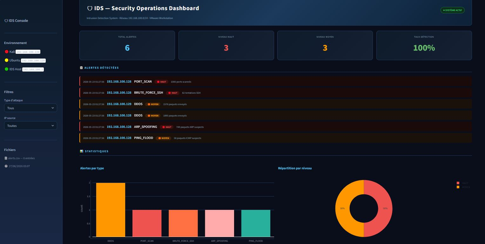
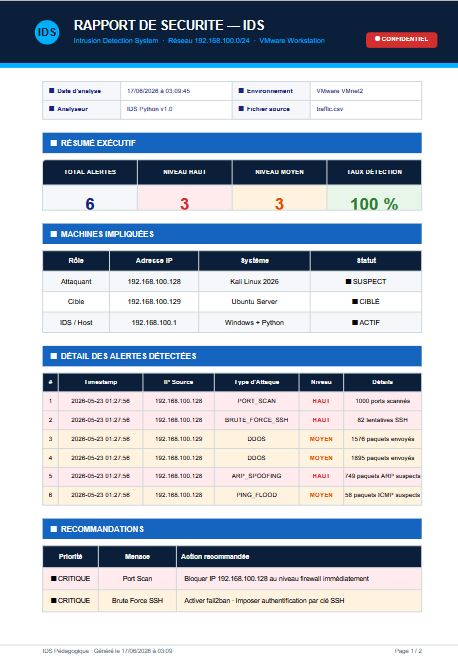
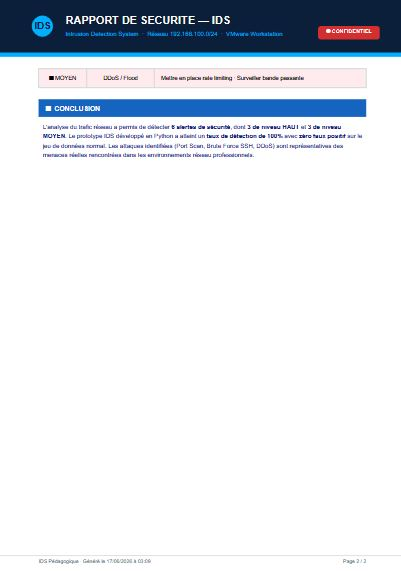

# Étude et Réalisation d’un système de
détection d’intrusion d’un réseau
informatique :
application à un réseau pédagogique

> Projet de Fin d'Année (PFA) — EMSI Casablanca 2025-2026
> Réalisé par : **Salah-Eddine Kouhail** 
> Encadrant : **M. Sayouti Adil**


---

## 📌 Description

Prototype d'un Système de Détection d'Intrusions (IDS) pédagogique, entièrement développé en Python, capable de :

- 🔍 Capturer le trafic réseau en temps réel via **Scapy**
- 🛡️ Détecter **5 types d'attaques réseau** réelles
- ⚠️ Classifier les alertes en **3 niveaux de risque**
- 📊 Visualiser les alertes via un **dashboard SOC interactif**
- 📄 Générer automatiquement un **rapport PDF professionnel**

---

## 🏗️ Architecture

```
        Kali Linux (attaquant)              Ubuntu Server (cible)
        192.168.100.128                     192.168.100.129
                │                                   │
                └───────────────┬───────────────────┘
                                 │
                    VMnet2 (réseau isolé, Host-only)
                         192.168.100.0/24
                                 │
                          capture.py (Scapy)
                                 │
                            traffic.csv
                                 │
                       detector.py (5 règles)
                                 │
                            alerts.csv
                                 │
                          app.py (Streamlit)
                          ┌──────┴──────┐
                   Dashboard SOC    Export PDF
```

---

## 🚨 Règles de détection

| # | Type d'attaque   | Outil Kali      | Seuil                        | Niveau   |
|---|------------------|-----------------|-------------------------------|----------|
| 1 | Port Scan        | `nmap -sS`      | > 50 ports / IP               | 🔴 HAUT  |
| 2 | Brute Force SSH  | `hydra`         | > 50 tentatives port 22       | 🔴 HAUT  |
| 3 | DDoS Flood       | `hping3`        | > 200 paquets / IP            | 🟠 MOYEN |
| 4 | ARP Spoofing     | `arpspoof`      | > 5 paquets ARP suspects      | 🔴 HAUT  |
| 5 | Ping Flood       | `hping3 -1`     | > 50 paquets ICMP             | 🟠 MOYEN |

---

## 📊 Résultats obtenus

| Indicateur                          | Valeur     |
|--------------------------------------|-----------|
| ✅ Taux de détection                 | **100%**  |
| ✅ Faux positifs (trafic normal)     | **0%**    |
| ✅ Alertes détectées                 | **6 alertes** |
| ✅ Lignes analysées                  | **4 084** |

---

## 🗂️ Structure du projet

```
ids-pedagogique/
├── capture.py            # Capture trafic réseau (Scapy)
├── detector.py            # Moteur de détection (5 règles)
├── app.py                  # Dashboard SOC (Streamlit + PDF)
├── generate_normal.py      # Génération trafic normal simulé
├── requirements.txt        # Dépendances Python
├── traffic.csv             # Données capturées
├── alerts.csv              # Alertes détectées
└── traffic_normal.csv      # Trafic normal (validation)
```

---
## 📸 Captures d'écran

### Dashboard SOC


### Rapport PDF — Page 1


### Rapport PDF — Page 2


## ⚙️ Installation & Utilisation

### 1. Cloner le projet
```bash
git clone https://github.com/salahkouhail/ids-pedagogique.git
cd ids-pedagogique
```

### 2. Installer les dépendances
```bash
pip install -r requirements.txt
```

### 3. Lancer la capture (droits admin requis)
```bash
python capture.py
```

### 4. Lancer la détection
```bash
python detector.py traffic.csv
```

### 5. Lancer le dashboard
```bash
streamlit run app.py
```

---

## 🖥️ Environnement de test

| Machine | OS                    | IP               | Rôle       |
|---------|-----------------------|------------------|------------|
| VM 1    | Kali Linux 2026       | 192.168.100.128  | Attaquant  |
| VM 2    | Ubuntu Server 22.04   | 192.168.100.129  | Cible      |
| Host    | Windows + Python 3.14 | 192.168.100.1    | IDS        |

> ⚠️ Réseau isolé VMware VMnet2 — Host-only — sans accès Internet

---

## 🛠️ Stack technique

| Technologie | Version | Usage                  |
|-------------|---------|-------------------------|
| Python      | 3.14    | Langage principal        |
| Scapy       | 2.7     | Capture réseau           |
| Pandas      | 3.0     | Traitement des données   |
| Streamlit   | 1.57    | Dashboard web             |
| Plotly      | 6.7     | Visualisations             |
| ReportLab   | 4.5     | Export PDF                  |

---

## ⚠️ Avertissement légal

Ce projet est développé dans un cadre **strictement pédagogique et défensif**.
Toutes les attaques simulées sont réalisées sur un réseau **isolé et contrôlé**.
Toute utilisation offensive est **illégale et contraire à l'éthique**.

---

## 📄 Licence

Projet académique — EMSI Casablanca — Année universitaire 2025-2026
